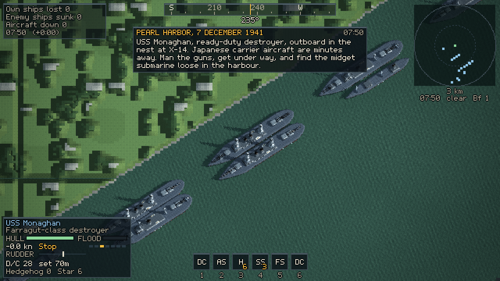
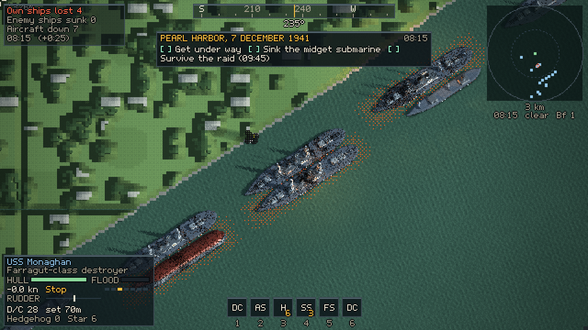
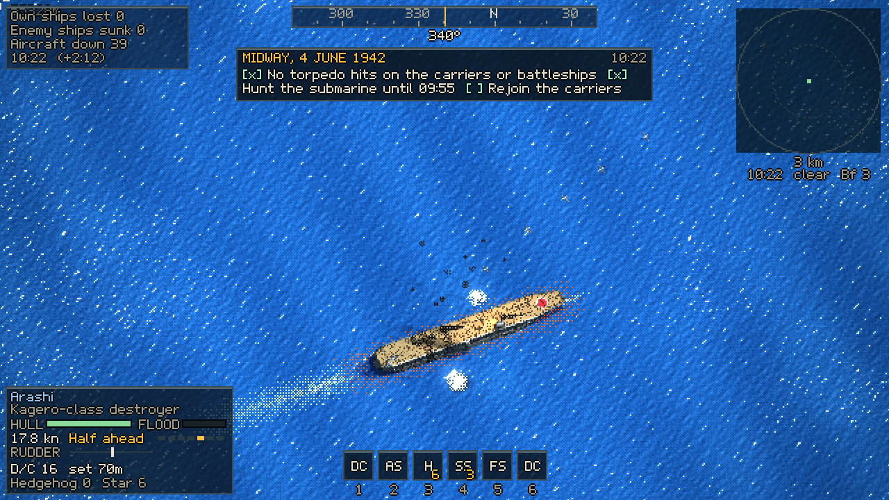
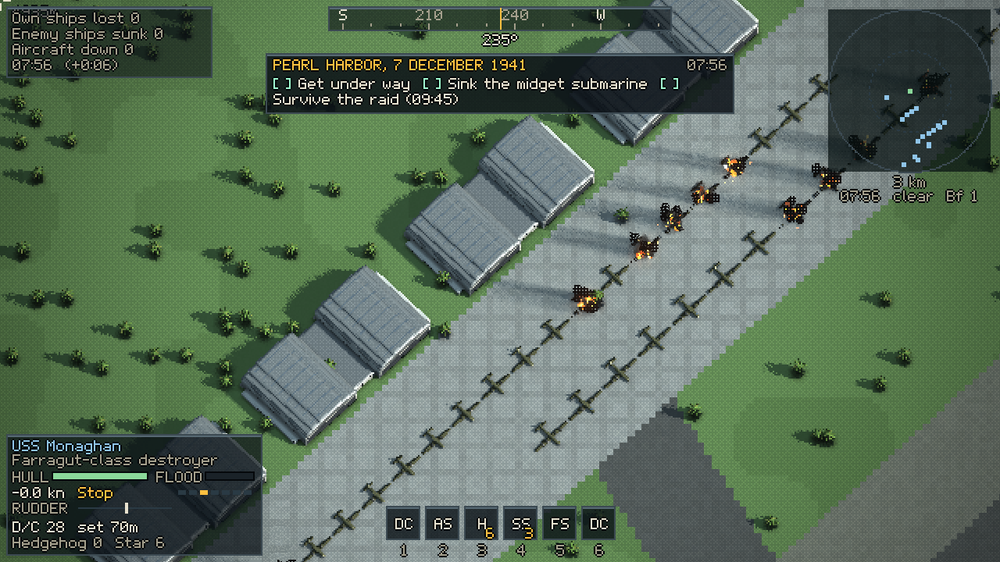
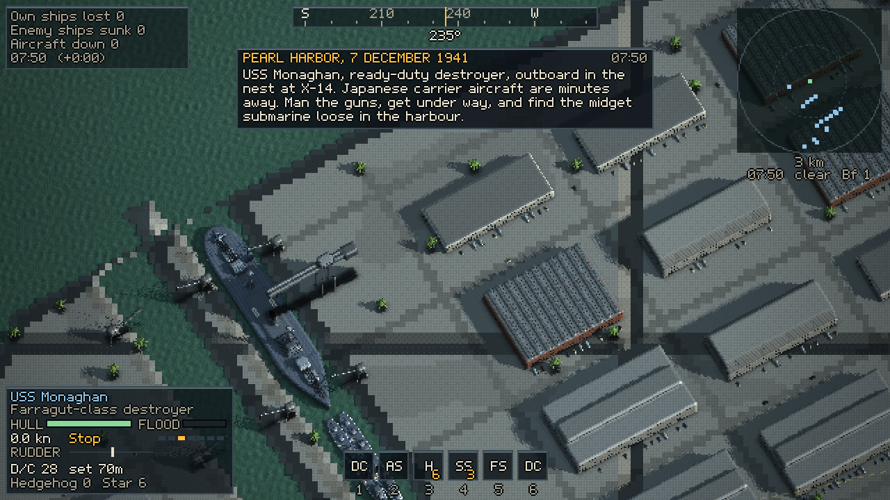

# Wolfpack & Escort

A WWII top-down pixel-art naval combat prototype for the browser. One customizable arena, two playable
sides:

- **The Escort**: command an Allied destroyer, sloop, frigate, corvette or armed trawler and bring a convoy
  through a U-boat wolfpack with ASDIC, depth charges, Hedgehog, star shells, searchlights and air cover.
- **The U-Boat**: command a Type VII, IX or XXI boat and attack the convoy with periscope, torpedoes and deck
  gun, using thermal layers, silent running and decoys to survive the hunt.

**Play it: <https://ww2-uboat-defense.vercel.app>** (deployed from `main`; needs a WebGPU or WebGL2 browser)


Ships are procedural voxel models drawn by sprite stacking, so they roll, pitch, list, burn and break in two.
The sea is a Gerstner swell plus GPU wave-equation and fluid simulations (wakes, foam, oil, burning oil,
bioluminescence). Rapier 3D drives buoyancy and hydrodynamics. Lighting is deferred, with occluder-heightmap
soft shadows and contact shadows, searchlight beams, star shells and fires; explosions, fires, flak and spray
add a second layer of GPU particles (compute shaders on WebGPU) with shockwaves that bend the screen, heat haze
over fires, light shafts from big blasts and camera shake. Progression borrows from Diablo IV / Path of Exile 2:
a passive skill tree per side, loot with affixes and legendary powers, active abilities and contracts.

| | |
|---|---|
|  |  |
|  |  |
|  |  |
|  |  |
|  | |

## Running it

```bash
npm install        # dependencies are pinned exactly
npm run dev        # http://localhost:5173
npm run build      # typecheck + production build to dist/ (npm run preview serves it)
npm test           # meta-layer unit tests (Node)
```

A WebGPU browser gives the full renderer: current Chrome or Edge, Safari 26+, or Firefox 141+ on Windows.
Browsers with only WebGL2 still run the game (best effort, see Renderer).

## Controls

| Action | Keyboard / mouse | Gamepad (PS5 glyphs) |
|---|---|---|
| Telegraph ahead / astern | W / S or ↑ / ↓ | D-pad ↑ / ↓, or flick the left stick |
| Rudder | A / D or ← / → | left stick |
| Aim; fire guns or torpedo | mouse; left click | right stick; R2 |
| Set course / lock target | right click | L2 |
| ASDIC ping / periscope view | Shift | R3 |
| Depth charge (K-gun port / starboard) | Space (Z / X) | R1 |
| Abilities 1–6 | 1–6 | □ △ ○ ✕ (hold L1 for 5–6) |
| U-boat: shallower / deeper | Q / E | D-pad ↑ / ↓ |
| U-boat: periscope, surface, periscope depth | Space, R, F | R1 |
| Searchlight | L | — |
| Cycle target, tactical plot, chart | T, Tab, M | D-pad →, Create, touchpad |
| Time compression | + / − | — |
| Zoom; camera mode | wheel or PgUp / PgDn; C | —; L3 |
| Collect salvage | G | D-pad ← |
| Pause / menu | Esc or P | Options |
| Tutorial: skip step | Enter | pause menu |

Every binding can be changed under Settings → Controls.

### Phones and tablets

Touch screens get their own layout, portrait (9:16) first; landscape works too. A battle goes fullscreen in
the orientation you hold the phone, and the back gesture pauses instead of leaving (on iPhone, Add to Home
Screen for a fullscreen app).

- **Left thumb**: point the course with the stick (it holds when you let go); the throttle above it sets the
  engine telegraph.
- **Right thumb**: four fixed buttons. U-boat: FIRE, DIVE / depth orders, SCOPE (GUN on the surface), ★
  abilities. Escort: depth charges (salvo; tap the depth chip for AUTO or a fixed depth), PING, GUNS AUTO, ★.
  A context button appears when one action matters: crash dive, fire a spread, drop a pattern, Hedgehog,
  star shell.
- **The sea**: tap a ship to lock it, drag to aim, pinch to zoom. Swipe a notification away to dismiss it.
- **Auto attack** (Settings → Controls, on for touch by default): FIRE picks a target and fires on the
  solution, the guns engage surfaced U-boats, the ASDIC keeps pinging a fresh contact and charge depths
  follow the plot.

After dark, and whenever it is submerged, your own boat gets a faint outline (Settings → Display → Night outline).

## Playing

- **Tutorial**: a guided battle for each side (title screen → Tutorial). A panel under the compass says what
  to do next (helm, hydrophones, diving, periscope, torpedoes and going deep; or ASDIC and depth-charge
  attacks for the escort) and ticks each step off as you do it.
- **Historic Battles** (title screen): Pearl Harbor (7 December 1941) and Midway (4 June 1942), every ship
  at true scale with the historical order of battle and timeline. Pearl Harbor is the real harbour (Ford
  Island, Battleship Row, the Navy Yard, the lochs; shores, docks and hangars fitted to surveyed points) with the
  fleet at its berths and both air waves. Ashore:
  the Navy Yard's dry docks, hammerhead crane and shops, the Naval Hospital on Hospital Point, the Submarine
  Base and its tank farms, Ford Island's hangars and Catalinas, Hickam's hangar line with its bombers parked
  wingtip to wingtip, Fort Kamehameha, Pearl City and Aiea with their streets, cars and trucks on the roads,
  launches and whaleboats on the water and AA guns firing from their pits; bombs crater the airfields and set
  parked aircraft and hangars burning. Play the
  destroyer Monaghan getting under way to hunt the midget submarine, or the midget submarine itself. At Midway
  the Kido Butai (Akagi, Kaga, Soryu, Hiryu and their screen) steams through the morning's attacks; play the
  destroyer Arashi hunting USS Nautilus, or Nautilus working in on the carriers. Your actions are free;
  whatever you leave alone happens as it did (scripted hits that your flak can still prevent).
- **Arena** (free play): pick the side, theater (North Atlantic, Arctic, Mediterranean, US East Coast,
  Caribbean, Indian Ocean), year (1939–1945 sets the technology), time of day, weather, sea state, convoy
  size, escorts, wolfpack size, air cover (air gap, occasional, escort carrier, constant) and more.
  U-boats start at periscope depth, surfaced only on a dark night before the escorts carry radar
  (Mission → U-boats start).
- **Career**: one captain per side with a port hub (Liverpool / Lorient). Contracts carry mutators and
  bounties; the shipyard sells vessels and components; the armory holds loot with affix tiers, rerolls and
  salvage. Each side has an 85-node passive skill tree, and there are 25 active abilities. An after-action
  report tallies XP and loot.
- **Fog of war**: AI and HUD only know what your side has detected (lookouts, radar, ASDIC, hydrophones,
  Huff-Duff, aircraft). Your own hydrophone bearings show as ticks on a ring around your boat, with a line to
  the contact you aim at (Settings → Display → Hydrophone bearings switches to lines or the full plot). Ships flood, list, burn, break in two and sink; their crews take to the boats.


## Settings

Settings → Developer exposes every tunable (over a hundred), grouped as Display, Camera, Water, Lighting,
Effects, Physics, Gameplay, AI, Audio, Controls and Debug. Presets: Cinematic / Balanced / Performance for quality,
Authentic / Arcade for gameplay. URL parameters override arena values for testing, for example
`/?side=uboat&theater=arctic&hour=2&weather=fog&seaState=6`; `CLAUDE.md` lists the test hooks.

## Renderer

WebGPU is the primary renderer (compute-shader water simulations, effect particles and 2D global illumination,
so fires and explosions light the hulls, buildings and water around them; timestamp profiling); WebGL2 runs the
same effect particles with transform feedback and the light bounce as fragment passes. WebGL2 is a best-effort fallback, used when WebGPU is missing, fails to start or loses its device mid-game. The scene is
drawn at a low internal resolution (about 640×360) and scaled up by whole pixels; the Performance preset
and the particle density settings (Water, Effects) help slower GPUs.

## Credits

- Pixel font and the sprite-stacking / pixel-art lighting techniques come from my-3d2dge by the same author.
- Physics: [Rapier](https://rapier.rs) (`@dimforge/rapier3d-compat`).
- Everything else (ship models, water, sound synthesis, music) is procedural code in this repository.

Contributors and coding agents: see `CLAUDE.md` (architecture, commands, test hooks) and `docs/PLAN.md`
(milestones and known issues).
