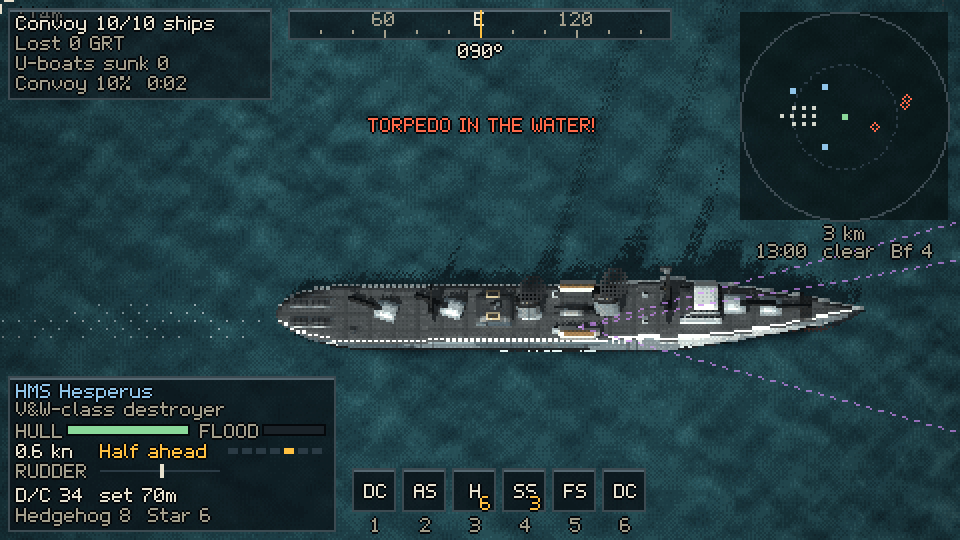
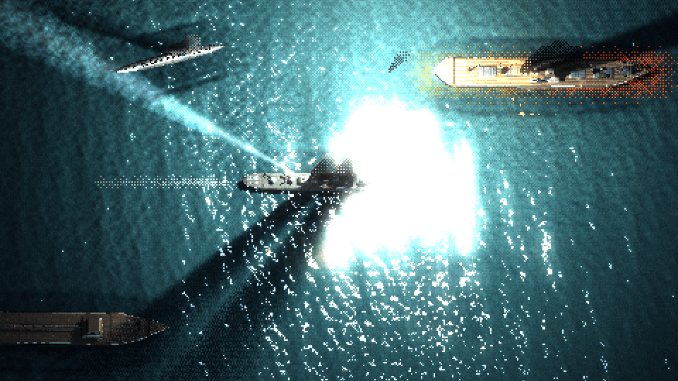
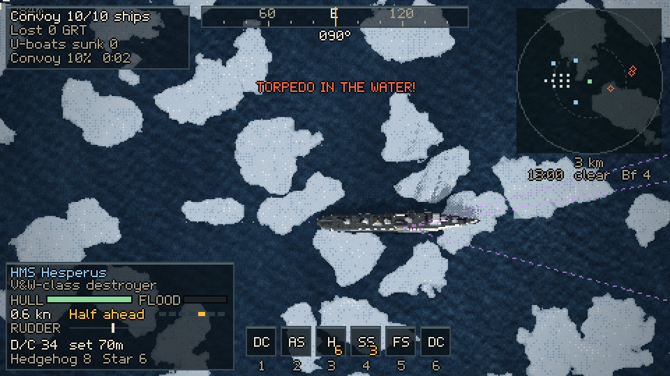
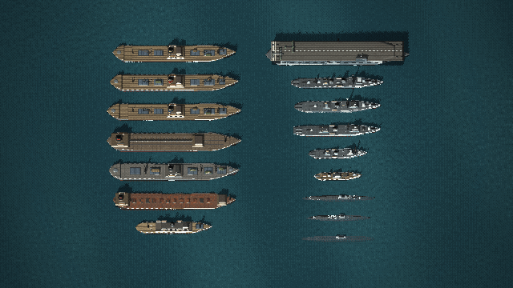
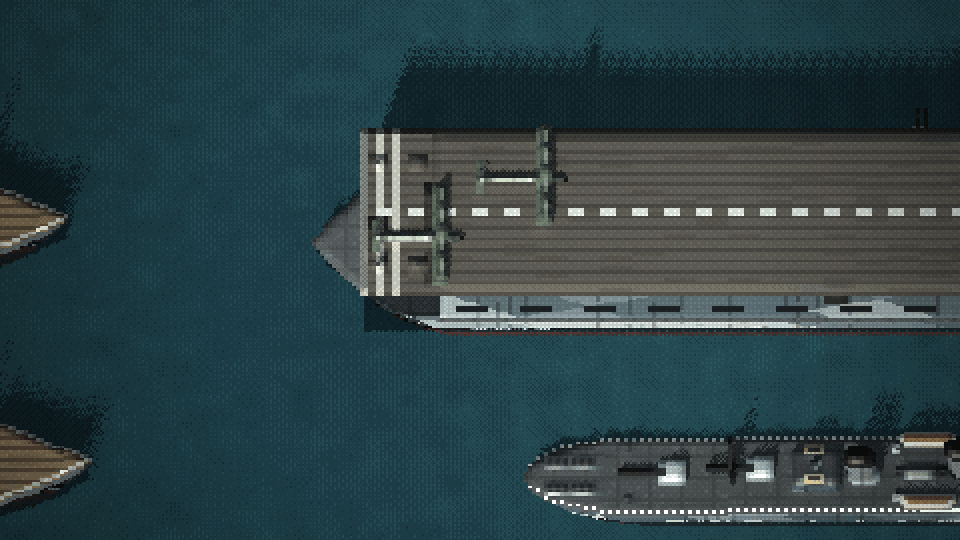
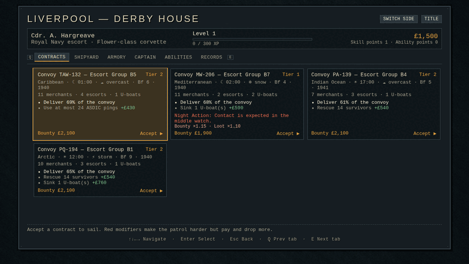
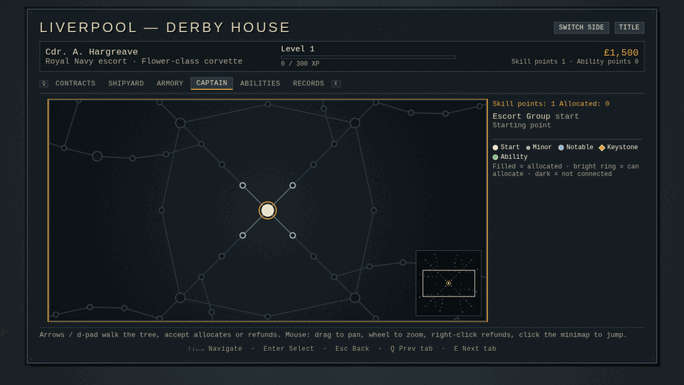

# Wolfpack & Escort

A WWII top-down pixel-art naval combat prototype for the browser. One customizable arena, two playable
sides:

- **The Escort**: command an Allied destroyer, sloop, frigate, corvette or armed trawler and bring a convoy
  through a U-boat wolfpack with ASDIC, depth charges, Hedgehog, star shells, searchlights and air cover.
- **The U-Boat**: command a Type VII, IX or XXI boat and attack the convoy with periscope, torpedoes and deck
  gun, using thermal layers, silent running and decoys to survive the hunt.



Ships are procedural voxel models drawn by sprite stacking, so they roll, pitch, list, burn and break in two.
The sea is a Gerstner swell plus GPU wave-equation and fluid simulations (wakes, foam, oil, burning oil,
bioluminescence). Rapier 3D drives buoyancy and hydrodynamics. Lighting is deferred, with occluder-heightmap
soft shadows, searchlight beams, star shells and fires. Progression borrows from Diablo IV / Path of Exile 2:
a passive skill tree per side, loot with affixes and legendary powers, active abilities and contracts.

| | |
|---|---|
|  |  |
|  |  |

## Running it

```bash
npm install        # dependencies are pinned exactly
npm run dev        # http://localhost:5173
npm run build      # typecheck + production build to dist/ (npm run preview serves it)
npm test           # meta-layer unit tests (Node)
```

A WebGPU browser gives the full renderer: current Chrome or Edge, Safari 26+, or Firefox 141+ on Windows.
Browsers with only WebGL2 still run the game (best effort, see Renderer).

## Controls

| Action | Keyboard / mouse | Gamepad (PS5 glyphs) |
|---|---|---|
| Telegraph ahead / astern | W / S or ↑ / ↓ | D-pad ↑ / ↓, or flick the left stick |
| Rudder | A / D or ← / → | left stick |
| Aim; fire guns or torpedo | mouse; left click | right stick; R2 |
| Set course / lock target | right click | L2 |
| ASDIC ping / periscope view | Shift | R3 |
| Depth charge (K-gun port / starboard) | Space (Z / X) | R1 |
| Abilities 1–6 | 1–6 | □ △ ○ ✕ (hold L1 for 5–6) |
| U-boat: shallower / deeper | Q / E | D-pad ↑ / ↓ |
| U-boat: periscope, surface, periscope depth | Space, R, F | R1 |
| Searchlight | L | — |
| Cycle target, tactical plot, chart | T, Tab, M | D-pad →, Create, touchpad |
| Time compression | + / − | — |
| Zoom; camera mode | wheel or PgUp / PgDn; C | —; L3 |
| Collect salvage | G | D-pad ← |
| Pause / menu | Esc or P | Options |

Every binding can be changed under Settings → Controls. On touch devices the left half of the screen is a
virtual stick, the right half aims (tap to fire), and finger-sized buttons carry the abilities and actions.

## Playing

- **Arena** (free play): pick the side, theater (North Atlantic, Arctic, Mediterranean, US East Coast,
  Caribbean, Indian Ocean), year (1939–1945 sets the technology), time of day, weather, sea state, convoy
  size, escorts, wolfpack size, air cover (air gap, occasional, escort carrier, constant) and more.
- **Career**: one captain per side with a port hub (Liverpool / Lorient). Contracts carry mutators and
  bounties; the shipyard sells vessels and components; the armory holds loot with affix tiers, rerolls and
  salvage. Each side has an 85-node passive skill tree, and there are 25 active abilities. An after-action
  report tallies XP and loot.
- **Fog of war**: AI and HUD only know what your side has detected (lookouts, radar, ASDIC, hydrophones,
  Huff-Duff, aircraft). Ships flood, list, burn, break in two and sink; their crews take to the boats.




## Settings

Settings → Developer exposes every tunable (over a hundred), grouped as Display, Camera, Water, Lighting,
Physics, Gameplay, AI, Audio, Controls and Debug. Presets: Cinematic / Balanced / Performance for quality,
Authentic / Arcade for gameplay. URL parameters override arena values for testing, for example
`/?side=uboat&theater=arctic&hour=2&weather=fog&seaState=6`; `CLAUDE.md` lists the test hooks.

## Renderer

WebGPU is the primary renderer (compute-shader water simulations, timestamp profiling). WebGL2 is a
best-effort fallback, used when WebGPU is missing, fails to start or loses its device mid-game. The scene is
drawn at a low internal resolution (about 640×360) and scaled up by whole pixels; the Performance preset
and the particle density setting help slower GPUs.

## Credits

- Pixel font and the sprite-stacking / pixel-art lighting techniques come from my-3d2dge by the same author.
- Physics: [Rapier](https://rapier.rs) (`@dimforge/rapier3d-compat`).
- Everything else (ship models, water, sound synthesis, music) is procedural code in this repository.

Contributors and coding agents: see `CLAUDE.md` (architecture, commands, test hooks) and `docs/PLAN.md`
(milestones and known issues).
